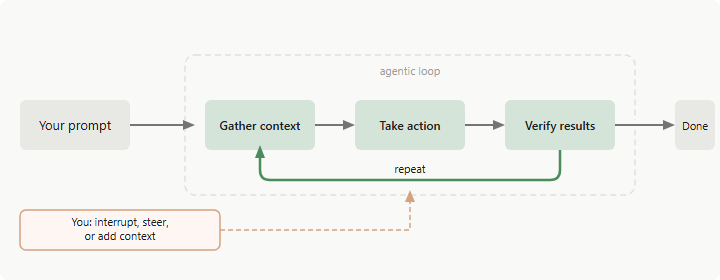

## How Claude Code works

### The agentic loop

#### Models

Claude can read code in any language, understand how components connect, and figure out what needs to change to accomplish your goal.

- Sonnet handles most coding tasks well.
- Opus provides stronger reasoning for complex architectural decisions.
- Switch with /model during a session or start with claude --model <name>.

#### Tools

| Category          | What Claude can do                                                                                                  |
| ----------------- | ------------------------------------------------------------------------------------------------------------------- |
| File operations   | Read files, edit code, create new files, rename and reorganize                                                      |
| Search            | Find files by pattern, search content with regex, explore codebases                                                 |
| Execution         | Run shell commands, start servers, run tests, use git                                                               |
| Web               | Search the web, fetch documentation, look up error messages                                                         |
| Code intelligence | See type errors and warnings after edits, jump to definitions, find references (requires code intelligence plugins) |

### What Claude can access

Claude Code gains access to:

- Your project. Files in your directory and subdirectories, plus files elsewhere with your permission.
- Your terminal. Any command you could run: build tools, git, package managers, system utilities, scripts. If you can do it from the command line, Claude can too.
- Your git state. Current branch, uncommitted changes, and recent commit history.
- Your CLAUDE.md. A markdown file where you store project-specific instructions, conventions, and context that Claude should know every session.
- Auto memory. Learnings Claude saves automatically as you work, like project patterns and your preferences. The first 200 lines or 25KB of \* MEMORY.md, whichever comes first, load at the start of each session.
- Extensions you configure. MCP servers for external services, skills for workflows, subagents for delegated work, and Claude in Chrome for browser interaction.

### Environments and interfaces

#### Execution environments

| Environment    | Where code runs                         | Use case                                                   |
| -------------- | --------------------------------------- | ---------------------------------------------------------- |
| Local          | Your machine                            | Default. Full access to your files, tools, and environment |
| Cloud          | Anthropic-managed VMs                   | Offload tasks, work on repos you don’t have locally        |
| Remote Control | Your machine, controlled from a browser | Use the web UI while execution and your files stay local   |

### Work with sessions

Claude Code saves your conversation locally as you work.

Sessions are independent. Each new session starts with a fresh context window, without the conversation history from previous sessions. Claude can persist learnings across sessions using auto memory, and you can add your own persistent instructions in CLAUDE.md.

#### Resume or fork sessions

Resuming a session with `claude --continue` or `claude --resume` reopens it under the same session ID and appends new messages to the existing conversation. Forking with `--fork-session` or `/branch` copies the history into a new session ID, leaving the original unchanged.

### Work effectively with Claude Code

#### Interrupt and steer

- Press `Esc` to stop Claude immediately. The running tool call is canceled and Claude waits for your next instruction.
- Type a correction and press `Enter` to send it without stopping the running tool. Claude reads it as soon as the current action completes and adjusts before deciding its next step.

## Extend Claude Code

### Skills

A skill is a markdown file containing knowledge, workflows, or instructions. You can invoke skills with a command like /deploy, or Claude can load them automatically when relevant. kehable tasks

### Match features to your goal

| Feature           | What it does                                                  | When to use it                                                                             | Example                                                                  |
| ----------------- | ------------------------------------------------------------- | ------------------------------------------------------------------------------------------ | ------------------------------------------------------------------------ |
| CLAUDE.md         | Persistent context loaded every conversation                  | Project conventions, “always do X” rules                                                   | ”Use pnpm, not npm. Run tests before committing.”                        |
| Skill             | Instructions, knowledge, and workflows Claude can use         | Reusable content, reference docs, repeatable tasks /deploy runs your deployment checklist; | API docs skill with endpoint patterns                                    |
| Subagent          | Isolated execution context that returns summarized results    | Context isolation, parallel tasks, specialized workers                                     | Research task that reads many files but returns only key findings        |
| Agent teams       | Coordinate multiple independent Claude Code sessions          | Parallel research, new feature development, debugging with competing hypotheses            | Spawn reviewers to check security, performance, and tests simultaneously |
| Code intelligence | Language-server navigation and diagnostics                    | Typed languages, large codebases where grep is slow or imprecise                           | Jump to a symbol’s definition instead of reading the whole file          |
| MCP               | Connect to external services                                  | External data or actions                                                                   | uery your database, post to Slack, control a browser                     |
| Hook              | Script, HTTP request, prompt, or subagent triggered by events | Automation that must run on every matching event                                           | Run ESLint after every file edit                                         |
| Artifact          | Publish session output as a private, interactive web page     | Output you want to see or share visually rather than as terminal text                      | An incident timeline that updates as Claude investigates                 |

### Build your setup over time

| Trigger                                                                          | Add                                                  |
| -------------------------------------------------------------------------------- | ---------------------------------------------------- |
| Claude gets a convention or command wrong twice                                  | Add it to CLAUDE.md                                  |
| You keep typing the same prompt to start a task                                  | Save it as a user-invocable skill                    |
| You paste the same playbook or multi-step procedure into chat for the third time | Capture it as a skill                                |
| You keep copying data from a browser tab Claude can’t see                        | Connect that system as an MCP server                 |
| Claude reads many files to find where a symbol is defined or used                | Install a code intelligence plugin for your language |
| A side task floods your conversation with output you won’t reference again       | Route it through a subagent                          |
| You want something to happen every time without asking                           | Write a hook                                         |

### Compare similar features

#### Skill vs Subagent

| Aspect                | Skill                                            | Subagent                                                       |
| --------------------- | ------------------------------------------------ | -------------------------------------------------------------- |
| What it is            | Reusable instructions, knowledge, or workflows   | Isolated worker with its own context                           |
| Key benefit           | Share content across contexts Context isolation. | Work happens separately, only summary returns                  |
| Context window impact | Adds to your main window                         | Uses a separate window with its own input and output tokens    |
| Best for              | Reference material, invocable workflows          | Tasks that read many files, parallel work, specialized workers |

## Explore the .claude directory

Most users only edit CLAUDE.md and settings.json.

| File                       | Scope              | Commit | What it does                                                                                             | Reference         |
| -------------------------- | ------------------ | ------ | -------------------------------------------------------------------------------------------------------- | ----------------- |
| CLAUDE.md                  | Project and global | ✓      | Instructions loaded every session                                                                        | Memory            |
| rules/\*.md                | Project and global | ✓      | Topic-scoped instructions, optionally path-gated                                                         | Rules             |
| settings.json              | Project and global | ✓      | Permissions, hooks, env vars, model defaults                                                             | Settings          |
| settings.local.json        | Project only       |        | Your personal overrides, gitignored when Claude Code saves a setting to it                               | Settings scopes   |
| .mcp.json                  | Project only       | ✓      | Team-shared MCP servers                                                                                  | MCP scopes        |
| .worktreeinclude           | Project only ✓     |        | Gitignored files to copy into new worktrees                                                              | Worktrees         |
| skills/<name>/SKILL.md     | Project and global | ✓      | Reusable prompts invoked with /name or auto-invoked                                                      | Skills            |
| commands/\*.md             | Project and global | ✓      | Single-file prompts; same mechanism as skills                                                            | Skills            |
| output-styles/\*.md        | Project and global | ✓      | Custom system-prompt sections                                                                            | Output styles     |
| agents/\*.md               | Project and global | ✓      | Subagent definitions with their own prompt and tools                                                     | Subagents         |
| workflows/\*.js            | Project and global | ✓ D    | ynamic workflow scripts written by Claude and saved from /workflows; each file becomes a /<name> command | Dynamic workflows |
| agent-memory/<name>/ P     | roject and global  | ✓      | Persistent memory for subagents                                                                          | Persistent memory |
| ~/.claude.json             | Global only        |        | App state, OAuth, UI toggles, personal MCP servers                                                       | Global config     |
| projects/<project>/memory/ | Global only        |        | Auto memory: Claude’s notes to itself across sessions                                                    | uto memory        |
| keybindings.json           | Global only        |        | Custom keyboard shortcuts                                                                                | Keybindings       |
| themes/\*.json             | Global only        |        | Custom color themes                                                                                      | ustom themes      |
